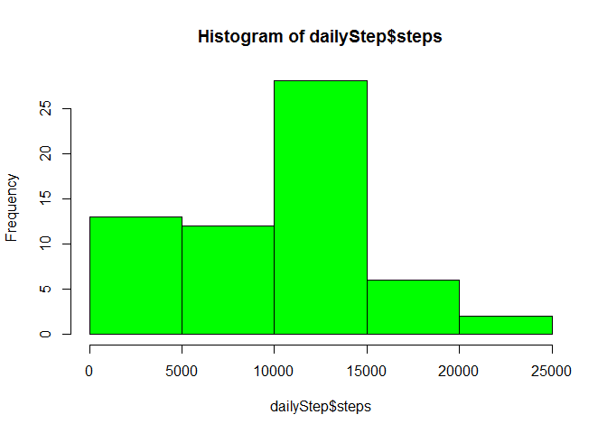
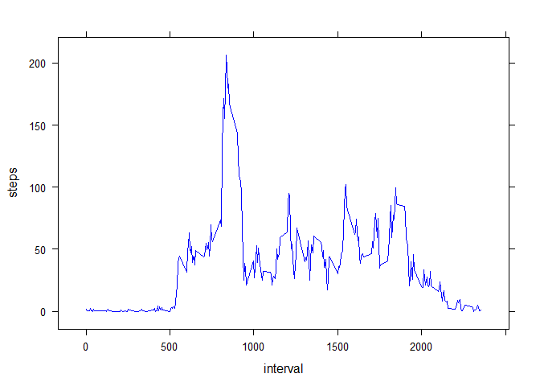
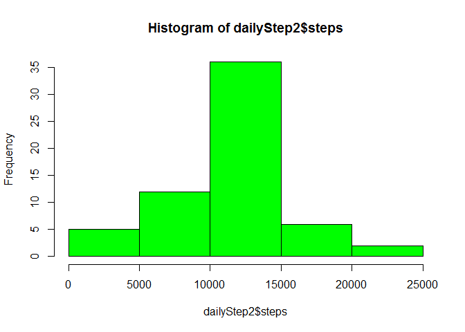
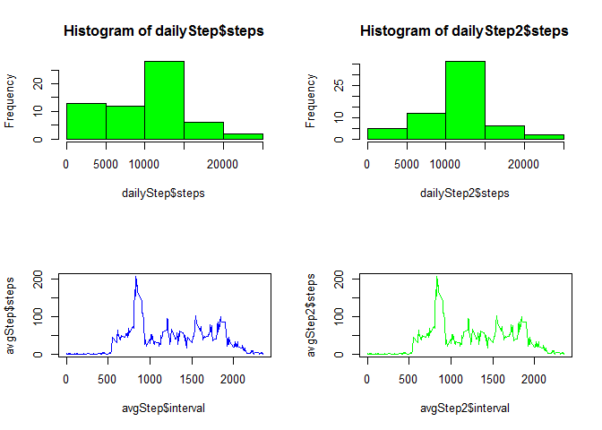
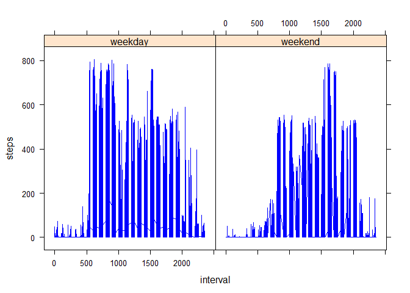

# Reproducible Research: Peer Assessment 1


## Loading and preprocessing the data


```r
if(!exists("activity")){
  unzip("activity.zip")
  activity <- read.csv("./activity.csv")
}

str(activity)
```

```
## 'data.frame':	17568 obs. of  3 variables:
##  $ steps   : int  NA NA NA NA NA NA NA NA NA NA ...
##  $ date    : Factor w/ 61 levels "2012-10-01","2012-10-02",..: 1 1 1 1 1 1 1 1 1 1 ...
##  $ interval: int  0 5 10 15 20 25 30 35 40 45 ...
```


## What is mean total number of steps taken per day?


```r
library(dplyr)

###Calculate the total number of steps taken per day
dailyStep <- group_by(activity, date) %>% summarize(steps = sum(steps, na.rm = TRUE))

hist(dailyStep$steps, col = "green")
```

<!-- -->

```r
#Calculate and report the mean and median of the total number of steps taken per day

summary(dailyStep$steps)
```

```
##    Min. 1st Qu.  Median    Mean 3rd Qu.    Max. 
##       0    6778   10400    9354   12810   21190
```

## What is the average daily activity pattern?


```r
library(lattice)

dailyStep <- group_by(activity, date) %>% summarize(steps = sum(steps, na.rm = TRUE))
hist(dailyStep$steps, col = "green")
```

<!-- -->
 
 + Make a time series plot (i.e. type = "l") of the 5-minute interval (x-axis) and the average number of steps taken, averaged across all days (y-axis)


```r
avgStep <- group_by(activity, interval) %>% summarize(steps = mean(steps, na.rm = TRUE))
xyplot(steps ~ interval , data = avgStep, type="l", col="blue")
```

<!-- -->

 + Which 5-minute interval, on average across all the days in the dataset, contains the maximum number of steps?


```r
avgStep$interval[which.max(avgStep$steps)]
```

```
## [1] 835
```

## Imputing missing values

  + Calculate and report the total number of missing values in the dataset (i.e. the total number of rows with NAs). Data shows high percentage of missing data. Also all missing data is on steps field. 


```r
## mean(is.na(activity))  -- this count na per cell.
mean(!complete.cases(activity)) # count na per row
```

```
## [1] 0.1311475
```

```r
mean(is.na(activity$steps))     # found all na is on steps
```

```
## [1] 0.1311475
```

  + Create a new dataset that is equal to the original dataset but with the missing data filled in. Filling is using average for the interval. Ref: http://stackoverflow.com/questions/9322773/how-to-replace-na-with-mean-by-subset-in-r-impute-with-plyr


```r
activity2 <- activity
for (j in which(is.na(activity2$steps))) {
  activity2[j, "steps"] <- avgStep[avgStep$interval == activity2[j,]$interval,]$steps
}
```

+ Make a histogram of the total number of steps taken each day and Calculate and report the mean and median total number of steps taken per day. Do these values differ from the estimates from the first part of the assignment? What is the impact of imputing missing data on the estimates of the total daily number of steps?


```r
dailyStep2 <- group_by(activity2, date) %>% summarize(steps = sum(steps, na.rm = TRUE))
hist(dailyStep2$steps, col = "green")
```

<!-- -->

```r
summary(dailyStep2$steps)
```

```
##    Min. 1st Qu.  Median    Mean 3rd Qu.    Max. 
##      41    9819   10770   10770   12810   21190
```

```r
avgStep2 <- group_by(activity2, interval) %>% summarize(steps = mean(steps, na.rm = TRUE))
xyplot(steps ~ interval , data = avgStep2, type="l", col="blue")
```

<!-- -->

```r
par(mfrow = c(2, 2))
hist(dailyStep$steps, col = "green")
hist(dailyStep2$steps, col = "green")

plot(avgStep$interval, avgStep$steps, type="l", col="blue")
plot(avgStep2$interval, avgStep2$steps , type="l", col="green")
```

<!-- -->


## Are there differences in activity patterns between weekdays and weekends?

For this part the `weekdays()` function may be of some help here. Use
the dataset with the filled-in missing values for this part.

+ Create a new factor variable in the dataset with two levels -- "weekday" and "weekend" indicating whether a given date is a weekday or weekend day.


```r
dayOfWeekStep2 <- group_by(activity2, interval, date) %>% 
        summarize(steps = sum(steps, na.rm = TRUE))  %>%
        mutate(dayOfWeek = ifelse(format(as.Date(as.character(date)), "%u") %in% c(6, 7),"weekend","weekday" ))
```

+ Make a panel plot containing a time series plot (i.e. `type = "l"`) of the 5-minute interval (x-axis) and the average number of steps taken, averaged across all weekday days or weekend days (y-axis). The plot should look something like the following, which was created using **simulated data**:


```r
#Make a panel plot containing a time series plot (i.e. type = "l") of the 5-minute interval (x-axis) and the average number of steps taken, averaged across all weekday days or weekend days (y-axis). 

xyplot(steps ~ interval |dayOfWeek , data = dayOfWeekStep2, type="l", col="blue")
```

<!-- -->
